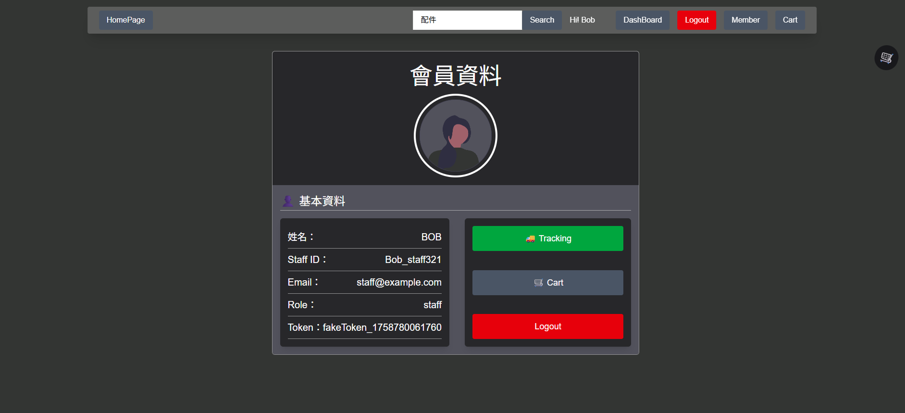

# BuyFlow 電商平台（React + Redux）

BuyFlow 是一個模擬的電商前端專案，使用 React 框架搭配 Redux Toolkit 進行狀態管理，涵蓋商品瀏覽、分類篩選、購物車管理與訂單流程等功能，並具備登入驗證與基礎權限控制。

---

## 專案預覽

- 首頁展示商品、分類與快速導覽功能
- 商品詳情支援圖片切換、加入購物車
- 使用者可登入、檢視訂單並結帳

| 頁面功能    | 畫面截圖                                    |
| ----------- | ------------------------------------------- |
| 首頁        |               |
| 登入頁面    |              |
| 會員中心    |          |
| 商城商品頁  |           |
| 商品詳情頁  |  |
| 結帳流程 -1 |        |
| 結帳流程 -2 |        |
| 訂單追蹤    |      |
| 後台頁面-1  |           |
| 後台頁面-2  |           |
| 後台頁面-3  |           |

---

## 技術與工具

- **React**
- **Redux Toolkit**（狀態與資料流管理）
- **React Router**（巢狀路由與動態詳情頁）
- **Tailwind CSS**（介面樣式快速開發）
- **Framer Motion**（動畫與互動）
- **Vite**（開發與打包工具）

---

## 專案功能模組

### 商品管理

- 商品列表
- 商品詳情（動態路由 `/products/:id`）
- 分類篩選與搜尋

### 購物車系統

- 加入 / 移除 / 數量調整
- 商品總金額統計
- 可視化購物車圖示與提示

### 使用者驗證

- 模擬登入 / 登出流程
- 使用者角色驗證（管理員 / 一般會員）
- 訂單頁面保護路由

### 結帳流程

- 填寫訂購人資訊（含表單驗證）
- 確認購物清單與金額
- 模擬送出訂單與成功頁面

---

## 🗂 專案結構

src/
│
├── components/ # 共用元件（Header, Footer, ProductCard 等）
├── features/ # Redux slices 模組化（cart, products, ui, user）
├── pages/ # 各主要頁面（Home, ProductList, Login, Cart 等）
├── router/ # 路由設定
├── assets/ # 圖片與 SVG
├── App.jsx # 主頁框架
└── main.jsx # 入口點
